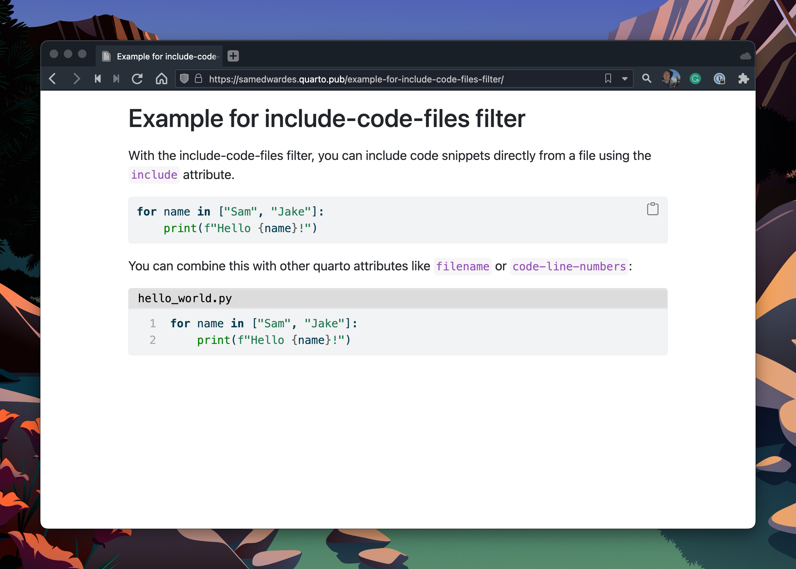

Include code from source files in pandoc
========================================

Pandoc filter to include code from source files as code blocks.

The filter is largely inspired by
[pandoc-include-code](https://github.com/owickstrom/pandoc-include-code)
written by [Oskar WICKSTRÖM](https://github.com/owickstrom).

This repository exists thanks to the work of [Albert
KREWINKEL](https://github.com/tarleb/) among other things in
[pandoc/lua-filters](https://github.com/pandoc/lua-filters/issues/207).

## Lua filter for pandoc

### Installing

The filter can be used without special installation, just by passing
the `include-code-files.lua` file path to pandoc via
`--lua-filter`/`-L`.

User-global installation is possible by placing the filter within the
filters directory of pandoc's user data directory. This allows to use
the filter just by using the filename, without having to specify the
full file path.

### Using

The filter recognizes code blocks with the `include` attribute present. It
swaps the content of the code block with contents from a file.

#### Including Files

The simplest way to use this filter is to include an entire file:

    ```{include="hello.c"}
    ```

You can still use other attributes, and classes, to control the code blocks:

    ```{.c include="hello.c" numberLines}
    ```

#### Ranges

If you want to include a specific range of lines, use `startLine` and `endLine`:

    ```{include="hello.c" startLine=35 endLine=80}
    ```

`start-line` and `end-line` alternatives are also recognized.

#### Dedent

Using the `dedent` attribute, you can have whitespaces removed on each line,
where possible (non-whitespace character will not be removed even if they occur
in the dedent area).

    ```{include="hello.c" dedent=4}
    ```

### Line Numbers

If you include the `numberLines` class in your code block, and use `include`,
the `startFrom` attribute will be added with respect to the included code's
location in the source file.

    ```{include="hello.c" startLine=35 endLine=80 .numberLines}
    ```

### Example

An HTML version of [input.md](test/input.md) can be produced as
[output.html](test/output.html) with this command:

    pandoc -s --lua-filter=include-code-files.lua test/input.md --output test/output.html


## Extension for Quarto




### Installing

```bash
quarto add SamEdwardes/include-code-files
```

This will install the extension under the `_extensions`
subdirectory. You will want to check in this directory if you're using
version control.

### Using

To use the include-code-files filter, add it to your documents YAML
front matter:

```yaml
---
title: "My doc"
filters:
  - include-code-files
---
```

With the include-code-files filter, you can include code snippets
directly from a file using `include`. For example, you may have a
python script like this:

```python
# _snippets/hello_world.py
for name in ["Sam", "Jake"]:
    print(f"Hello {name}!")
```

To render this file in a code chunk, use the `include` attribute:

``````markdown
```{.python include="_snippets/hello_world.py"}
```
``````

You can combine this with other quarto attributes like `filename` or `code-line-numbers`:

``````markdown
```{.python include="_snippets/hello_world.py" filename="hello_world.py" code-line-numbers="true"}
```
``````

### Example

Here is the source code for a minimal example:
[example.qmd](docs/example.qmd). See a rendered sample here:
<https://samedwardes.quarto.pub/example-for-include-code-files-filter/>.

